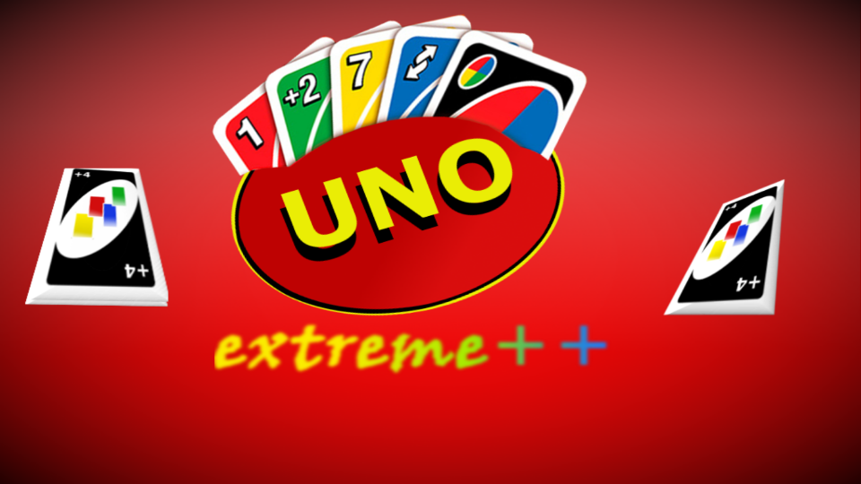
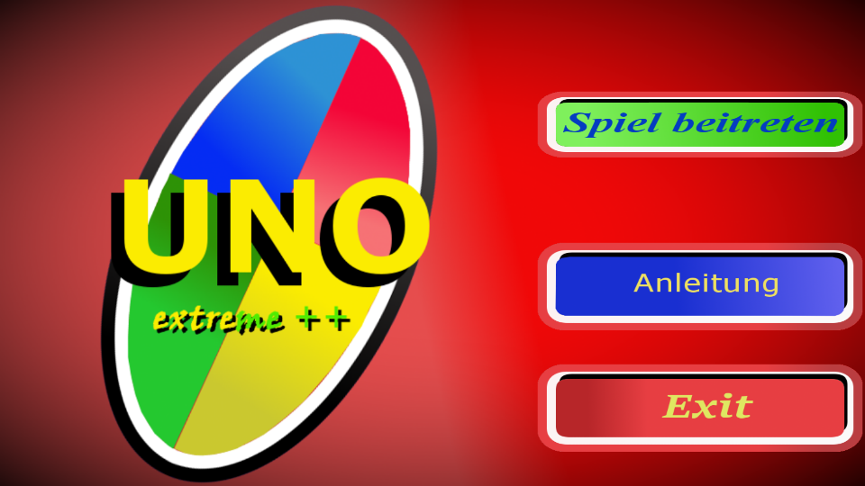
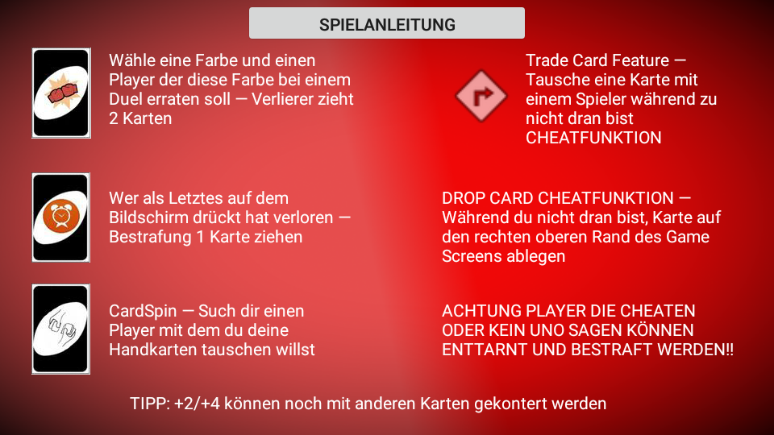
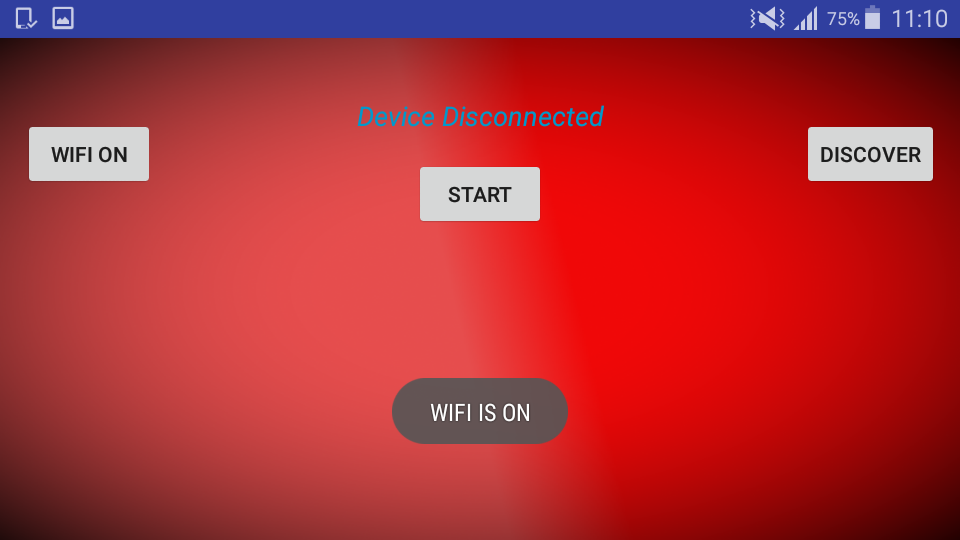

# Welcome to UNO Plus
This project is a reimplementation of the great card game called "UNO" everybody knows.

### The requirements:
- Mulitplayer functionality (2 - 4 or more Players, via P2P)
- Implementation of cheats and also blame or accusing Players
- Additional features which brings more fun in the original game

### Use of:
* Github
* Android Studio
* Travis 
* Sonarcloud 
* Jacoco 
* Gradle

UNO Plus uses Android solid Framework

### Game describtion 
Individual Uno Game with Features like:

Sorted Handcards

**Special cards:** hotdrop card, duelcard, cardpsin card

**Cheats:** Drop card, Trade card, conter +2/+4 

### Features
- **Sorted handcards:** Players have sorted handcards on screen.
- **Hotdrop card:**  Every Player has to click on the screen, the last clicked player draws a card
* **Duel card:** Player picks a color of a card and a player. The selected player has to guess the correct color. The loser draws 2 cards.
* **Cardspin card:** Trades all handcards with a Player

* **Drop card:** Every Player has the possibility to drop a Card (under the table). Only one card if its not your turn.
* **Trade card:** Every Player can trade a single card with other players.
* **Conter possibility:** Players can conter +2 or +4 card with the reverse card or with the locking card.

### How to connect
- Open the UNOPlus App after titlescreen you will be directed to the main menu
- Main Menu click on "Spiel beitreten" and you will be directed to the "lobby"
- After automatically set on the WiFi you can click on "DISCOVER" to discover other players,
- if you find other players you can click on them to send them an invite for a quick game
- if all players are connected the HOST has to click "START" and also clients has to click on "START" in that direction
- if all succeed, all players will be directed to the game screen

### Authors

Martin Proprentner

Sebastian Trattnig

Ekaterina Königstorfer 

Luca Rodiga

Jennifer Gradischnig

Josef Habich
